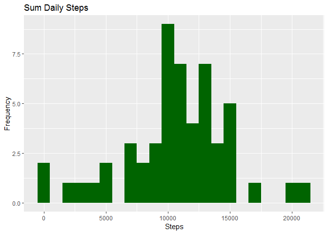
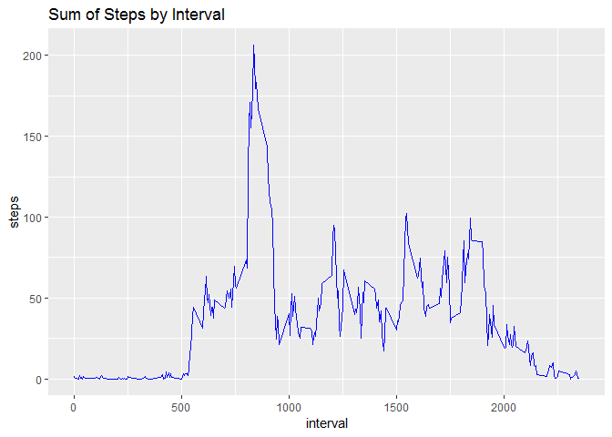
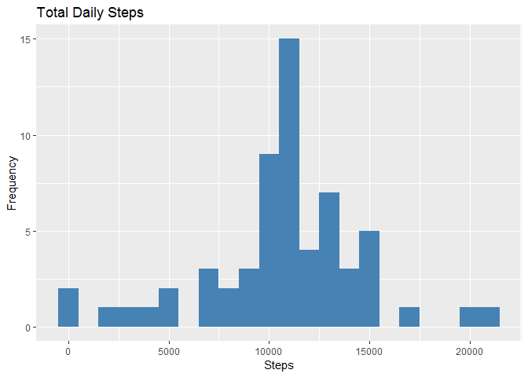
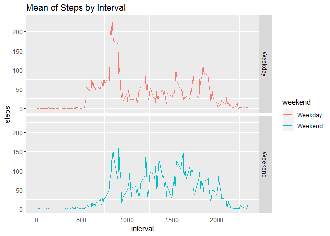

# Reproductible Research: PA1


## Load and pre-process the data
#### 1.graphics library load


#### 2.unzip and read data

```r
setwd("~/R_MW_20180914/RRWeek2")
unzip("repdata%2Fdata%2Factivity.zip")
data <- read.csv("activity.csv", header = TRUE)
```

#### 3.Clean NA and Date class modification


```r
data$date <- as.Date(as.character(data$date))
dataC<- data[!is.na(data$steps),]
```

## mean total number of steps taken per day.

#### 1. create new dataset: steps based on sum

```r
stepsBd <- aggregate(dataC$steps, by=list(dataC$date), sum)
names(stepsBd)[1]="date"
names(stepsBd)[2]="sumsteps"
```

#### 2. Histogram of the total number of steps taken each day

```r
ggplot(stepsBd, aes(x = sumsteps)) +
  geom_histogram(fill = "darkgreen", binwidth=1000) +
  labs(title = "Sum Daily Steps", x = "Steps", y = "Frequency")
```

<!-- -->

#### 3. Mean and median of the total number of steps taken each day

```r
Mean <- mean(stepsBd$sumsteps,na.rm=TRUE)
Median <- median(stepsBd$sumsteps,na.rm=TRUE)
```

* Mean: 1.0766189\times 10^{4} 
* Median: 10765

-----

## Average daily activity pattern

#### 1. create new dataset: steps based on interval

```r
stepsBim <- aggregate(dataC$steps, by=list(dataC$interval), mean)
names(stepsBim)[1] ="interval"
names(stepsBim)[2] ="steps"
```

#### 2. Time series plot

```r
ggplot(stepsBim, aes(x = interval, y=steps)) +
  labs(title = "Sum of Steps by Interval", x = "interval", y = "steps")+
  geom_line(color="blue") 
```

<!-- -->

#### 3. Max value

```r
max <- stepsBim[which.max(stepsBim$steps),]
```
  
* Most Steps at: 835, 206.1698113

-----

## Missing value
#### 1. Total number of missing values in the dataset


```r
dataNA <- is.na(data)
total <- sum(dataNA)
```

* Number of missing values: 2304

#### 2. Devise a strategy for filling in all of the missing values in the dataset: Use mean interval steps from Mean Steps for that interval

#### 3. Create new dataset: missing data filled in with mean by intervals

```r
meanf <- tapply(dataC$steps, dataC$interval, mean, na.rm=TRUE, simplify=TRUE)
data2 <- data
datam <- is.na(data2$steps)
data2$steps[datam]<-meanf[as.character(data2$interval[datam])]
```

##### 4. Histogram of the total number of steps taken each day

```r
stepsBds <- aggregate(data2$steps, by=list(data2$date), sum)
names(stepsBds)[1] ="date"
names(stepsBds)[2] ="sumsteps"

ggplot(stepsBds, aes(x = sumsteps)) +
  geom_histogram(fill = "steelblue", binwidth=1000) +
  labs(title = "Total Daily Steps", x = "Steps", y = "Frequency")
```

<!-- -->

#### 5. Mean and median of the total number of steps taken each day

```r
Mean2 <- mean(stepsBds$sumsteps,na.rm=TRUE)
Median2 <- median(stepsBds$sumsteps,na.rm=TRUE)
```

* Mean2: 1.0766189\times 10^{4} 
* Median2: 1.0766189\times 10^{4}

#### 6. Do these values differ from the estimates from the first part of the assignment?:Yes, the mean is the same but the median has risen 1.19 steps.
#### 7.  What is the impact of imputing missing data on the estimates of the total daily number of steps?: The effect of using mean data per interval as a data impute method for missing values seems to push overall data towards the mean.


## Are there differences in activity patterns between weekdays and weekends?

##### 1. Create a new factor variable in the dataset with two levels: weekday and weekend indicating whether a given date is a weekday or weekend day.

```r
data2$weekday <- weekdays(data2$date)
data2$weekend <- ifelse (data2$weekday == "Saturday" | data2$weekday == "Sunday", "Weekend", "Weekday")
```


#### 2. Create a subset and plot the mean of steps by interval weekdays and weekends

```r
MeanWeek <- aggregate(data2$steps, by=list(data2$weekend, data2$interval), mean)
names(MeanWeek)[1] ="weekend"
names(MeanWeek)[2] ="interval"
names(MeanWeek)[3] ="steps"

ggplot(MeanWeek, aes(x = interval, y=steps, color=weekend)) +
  geom_line() +
  facet_grid(weekend ~ .) +
  labs(title = "Mean of Steps by Interval", x = "interval", y = "steps")
```

<!-- -->


  
